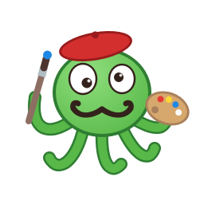
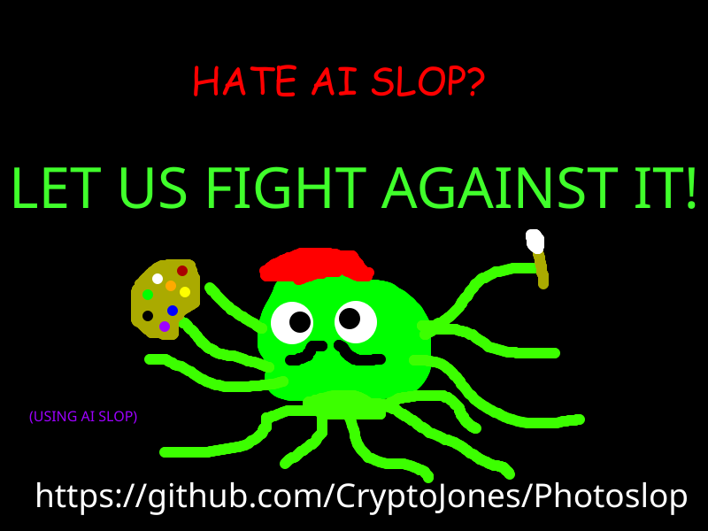

# Photoslop



A memory-frugal, multiplatform, layered raster image editor — Photoshop-shaped, Qt-native, zero Electron.

[](https://github.com/CryptoJones/Photoslop/actions/workflows/test.yml)
[](LICENSE)
[](https://github.com/CryptoJones/Photoslop)
[](https://www.python.org/)
[]()

---

<p align="center">
  
  <br>
  <em>Le Basilisk</em>, the Photoslop mascot.
</p>

## What it does

Photoslop is a small, fast, layered image editor that runs anywhere Qt runs
(Linux, Windows, macOS) and treats RAM like it costs money:

- **Layers** — add, delete, duplicate, reorder, hide/show, per-layer opacity,
  13 blend modes (multiply, screen, overlay, dodge/burn, difference…)
  saved interoperably in `.ora`, non-destructive layer masks (from
  selection or reveal-all; apply/delete), and clipping masks
  (`Ctrl+Alt+G`).
- **Painting** — round brush with size/hardness/opacity and an eraser mode;
  aliased pencil for pixel work; paint
  bucket with adjustable tolerance; linear/radial gradients (`Shift+G`,
  foreground→background); eyedropper (`I`) sampling the merged
  composite; foreground/background colour pair with `X` swap and `D` reset.
- **Selections** — rectangle marquee, freehand lasso, polygonal lasso, and
  magic wand (tolerance-based, Shift adds / Alt subtracts, contiguous
  toggle for colour-range selection), and quick selection (`Shift+W`,
  paint to grow); delete selection, copy
  selection, paste as new layer.
- **Cross-image workflow** — multiple documents in tabs; copy a layer (or a
  selection) in one image and paste it into another.
- **Geometry** — crop to selection, image resize (resamples every layer), canvas
  resize with 9-way anchor; rotate the image 90°/180° or flip it (layers and
  guides come along), rotate/flip individual layers about their centre, and
  Free Transform (`Ctrl+T`) for freehand scale/rotate/move with live preview
  (Ctrl+drag corners/edges for distort, skew, and perspective).
- **Rulers & guides** — rulers in pixels, millimetres, picas, or freedom
  units (inches); drag guides out of the rulers, drag them back off to
  remove. While a guide is dragged, a marker tracks it on the matching ruler
  and a floating label shows its live X/Y position in the current unit;
  guides snap to the visible minor ruler ticks (hold Shift to place freely);
  a grid overlay follows the same spacing, and dragged layers snap their
  edges to guides and canvas edges.
- **Adjust panel** — Lightroom-style Basic sliders (Temp, Tint, Exposure,
  Contrast, Highlights, Shadows, Whites, Blacks, Vibrance, Saturation) in a
  tab next to Layers; live preview, one undo step per Apply. Levels
  (`Ctrl+L`) with auto black/white points; Hue/Saturation (`Ctrl+U`); Color Balance (`Ctrl+B`); Curves (`Ctrl+M`).
- **Undo/redo** — region-based undo that stores only the pixels a stroke
  touched, with a History panel to click back to any earlier state.
- **Files** — opens and saves layered [OpenRaster](https://www.openraster.org/)
  (`.ora`, interoperable with GIMP and Krita); imports/exports PNG, JPEG, BMP,
  and WebP. The Open dialog shows a live thumbnail preview with dimensions,
  format, layer count, and file size — decoded scaled-down, so browsing huge
  folders stays fast. Export As offers format/quality/scale controls with a
  live preview and the real encoded size.

## Why the memory frugality

Image editors bloat because they cache everything. Photoslop instead:

- keeps exactly **one pixel buffer per layer** (premultiplied ARGB32; pasted
  layers are sized to their content) — no full-canvas mirrors, no flattened
  composite cache;
- composites **only the viewport region** being repainted, at the current zoom;
- relies on Qt's **copy-on-write** image sharing, so duplicating layers and
  copying selections cost nothing until pixels actually change;
- stores undo as **dirty-rect deltas** (just the pixels a stroke touched), with a
  bounded stack depth;
- flood-fills with an **iterative scanline** algorithm — no recursion, no
  per-pixel Python.

## Quick start

```bash
# from a checkout
uv sync
uv run photoslop

# or straight from the forge
uvx --from git+https://github.com/CryptoJones/Photoslop photoslop
```

Prefer a one-command launcher? From a checkout, run **`./run.sh`**
(Linux/macOS) or **`run.cmd`** (Windows) — each bootstraps `uv` if it's
missing, then starts the app. Any arguments pass straight through to
`photoslop` (e.g. `./run.sh path/to/image.png`).

## Tools & shortcuts

| Tool / action        | Shortcut     |
| -------------------- | ------------ |
| Brush                | `B`          |
| Pencil               | `Shift+B`    |
| Paint bucket         | `G`          |
| Gradient             | `Shift+G` (linear/radial) |
| Eyedropper           | `I` (Shift-click → background) |
| Swap / reset colours | `X` / `D`    |
| Rectangle select     | `M`          |
| Lasso (area) select  | `L`          |
| Polygonal lasso      | `Shift+L`    |
| Magic wand           | `W` (Shift adds, Alt subtracts) |
| Move layer           | `V`          |
| Hand (pan)           | `H` (or hold `Space`) |
| Zoom tool            | `Z` (Alt-click zooms out) |
| Cut selection        | `Ctrl+X`     |
| Copy selection       | `Ctrl+C`     |
| Paste as new layer   | `Ctrl+V`     |
| Delete selection     | `Del`        |
| Merge down / visible | `Ctrl+E` / `Ctrl+Shift+E` |
| Stamp visible        | `Ctrl+Shift+Alt+E` |
| Copy layer           | `Ctrl+Shift+C` |
| Paste layer          | `Ctrl+Shift+V` |
| Brush size / hardness | `[` / `]` and `Shift+[` / `Shift+]` |
| Undo / redo          | `Ctrl+Z` / `Ctrl+Shift+Z` |
| Zoom in / out / fit  | `Ctrl++` / `Ctrl+-` / `Ctrl+0` |
| Free Transform       | `Ctrl+T` (Enter commits, Esc cancels) |
| Crop tool            | `C` (drag, Enter commits) |
| Crop to selection    | `Ctrl+Alt+C` |

## Design decisions

What Photoslop deliberately won't do (and why) is recorded in
[DESIGNDECISIONS.md](DESIGNDECISIONS.md) — memory performance beats
features, and the reasoning is append-only.

## Development

```bash
uv sync --extra dev
uv run ruff check .
QT_QPA_PLATFORM=offscreen uv run pytest
```

## Documentation

The full v1 feature library — every tool, menu, format, and CLI operation —
lives in [docs/v1/](docs/v1/README.md), including an honest
[feature-parity matrix](docs/v1/feature-parity.md) against Photoshop, GIMP,
Paint.NET, Lightroom Classic, darktable, and Capture One.

## Command line (headless)

Everything scripts without a window via `photoslop-cli` — operations apply in
command-line order, so pipelines compose left to right:

```bash
photoslop-cli shot.cr2 --resize 1600x1067 --auto-levels --gaussian-blur 2 \
              --select 200,150,400,300 --generative-fill "wildflowers" \
              --drop-shadow 6,6,10,140 --output final.png
```

`--output x.ora` keeps layers (effects and all); raster extensions flatten.
`--info` prints the document as JSON; `--export-artboards DIR` batch-exports.
Model ops use the same bring-your-own-backend contract as the GUI via
`--model-url`. See `photoslop-cli --help` for the full operation set —
every GUI engine feature is exposed (interactive brushes excepted).

## Model backends (bring your own model)

Model-assisted features (Edit → **Select Subject (Model)**) never hardwire a
model. Configure any backend under Edit → Options → **Model Backend…**:

- **Generic HTTP adapter** — point it at any server you run. The contract is
  JSON with base64 PNGs: `POST <base>/select-subject {"image": …}` returns
  `{"mask": …}`; `POST <base>/generative-fill {"image": …, "mask": …,
  "prompt": …}` returns `{"image": …}`. Wrap ComfyUI, a rembg/SAM script, or
  a cloud API in a few lines of Flask and you're in.
- **pip plugins** — packages can register `photoslop.modeladapter.ModelAdapter`
  subclasses under the `photoslop.model_adapters` entry-point group and they
  appear in the picker automatically.

## License

Apache 2.0. See [LICENSE](LICENSE).

Proudly Made in Nebraska. Go Big Red! 🌽 https://xkcd.com/2347/
