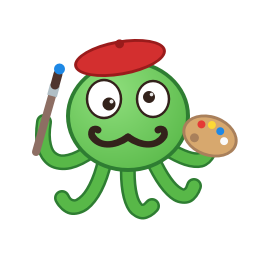
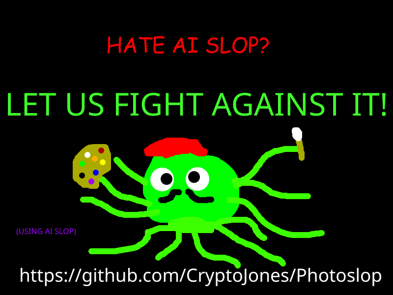
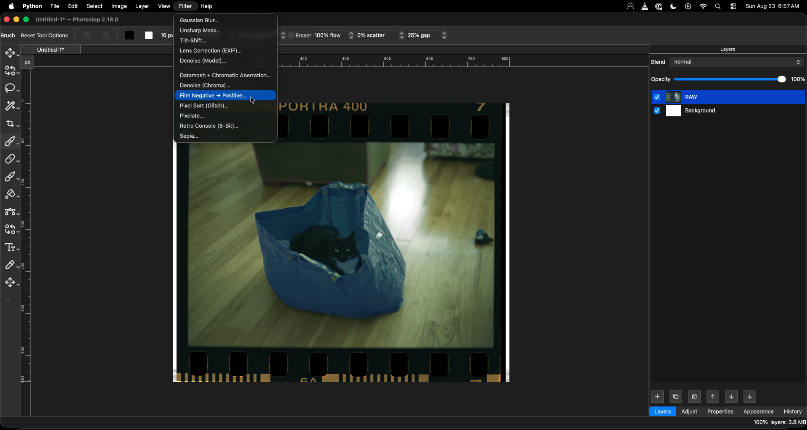

# Photoslop



A memory-frugal, multiplatform, layered raster image editor — Photoshop-shaped, Qt-native, zero Electron.

[](https://github.com/CryptoJones/Photoslop/actions/workflows/test.yml)
[](LICENSE)
[](https://github.com/CryptoJones/Photoslop)
[](https://www.python.org/)
[]()

> **💚 Support Photoslop** — if this app saves you money or RAM, consider tossing a few bucks at the project:
> **CashApp [`$cryptojones`](https://cash.app/$cryptojones)** · **Venmo [`@CryptoJones`](https://venmo.com/u/CryptoJones)**

---

<p align="center">
  
  <br>
  <em>Le Basilisk</em>, the Photoslop mascot.
</p>

## What it does

Photoslop is a small, fast, layered image editor that runs anywhere Qt runs
(Linux, Windows, macOS, iPadOS, and iOS) and treats RAM like it costs money:

- **Layers** — add, delete, duplicate, reorder, hide/show, per-layer opacity,
  13 blend modes (multiply, screen, overlay, dodge/burn, difference…)
  saved interoperably in `.ora`, non-destructive layer masks (from
  selection or reveal-all; apply/delete), and clipping masks
  (`Ctrl+Alt+G`).
- **Painting** — round brush with size/hardness/opacity and an eraser mode;
  aliased pencil for pixel work; paint
  bucket with adjustable tolerance; linear/radial gradients (`Shift+G`,
  foreground→background); eyedropper (`I`) sampling the merged
  composite; foreground/background colour pair with `X` swap and `D` reset.
- **Selections** — rectangle marquee, freehand lasso, polygonal lasso, and
  magic wand (tolerance-based, Shift adds / Alt subtracts, contiguous
  toggle for colour-range selection), and quick selection (`Shift+W`,
  paint to grow); delete selection, copy
  selection, paste as new layer.
- **Cross-image workflow** — multiple documents in tabs; copy a layer (or a
  selection) in one image and paste it into another.
- **Geometry** — crop to selection, crop one layer without touching the canvas,
  image resize (resamples every layer), canvas
  resize with 9-way anchor; rotate the image 90°/180° or flip it (layers and
  guides come along), rotate/flip individual layers about their centre, and
  Free Transform (`Ctrl+T`) for freehand scale/rotate/move with live preview
  (Ctrl+drag corners/edges for distort, skew, and perspective).
- **Film** — develop a scanned negative into the positive photograph, colour or
  black-and-white, detected from the negative itself (the orange mask of a
  colour negative is removed rather than inverted along with everything else).

  <p align="center">
    
    <br>
    <em>A Portra 400 frame, developed — mask removed, not merely inverted.</em>
  </p>
- **Rulers & guides** — rulers in pixels, millimetres, picas, or freedom
  units (inches); drag guides out of the rulers, drag them back off to
  remove. While a guide is dragged, a marker tracks it on the matching ruler
  and a floating label shows its live X/Y position in the current unit;
  guides snap to the visible minor ruler ticks (hold Shift to place freely);
  a grid overlay follows the same spacing, and dragged layers snap their
  edges to guides and canvas edges.
- **Adjust panel** — Lightroom-style Basic sliders (Temp, Tint, Exposure,
  Contrast, Highlights, Shadows, Whites, Blacks, Vibrance, Saturation) in a
  tab next to Layers; live preview, one undo step per Apply. Levels
  (`Ctrl+L`) with auto black/white points; Hue/Saturation (`Ctrl+U`); Color Balance (`Ctrl+B`); Curves (`Ctrl+M`).
- **Undo/redo** — region-based undo that stores only the pixels a stroke
  touched, with a History panel to click back to any earlier state.
- **Appearance effects** — an ordered, non-destructive stack for every layer:
  shadows, glows, outlines, color/gradient overlays, bevel/emboss, blur, and
  feather. Effects stay editable, support built-in and user presets, survive
  OpenRaster saves, and export through SVG filters.
- **Files** — opens and saves layered [OpenRaster](https://www.openraster.org/)
  (`.ora`, interoperable with GIMP and Krita); imports/exports PNG, JPEG, BMP,
  and WebP. The Open dialog shows a live thumbnail preview with dimensions,
  format, layer count, and file size — decoded scaled-down, so browsing huge
  folders stays fast. Export As offers format/quality/scale controls with a
  live preview and the real encoded size.

## Why the memory frugality

Image editors bloat because they cache everything. Photoslop instead:

- keeps exactly **one pixel buffer per layer** (premultiplied ARGB32; pasted
  layers are sized to their content) — no full-canvas mirrors, no flattened
  composite cache;
- composites **only the viewport region** being repainted, at the current zoom;
- relies on Qt's **copy-on-write** image sharing, so duplicating layers and
  copying selections cost nothing until pixels actually change;
- stores undo as **dirty-rect deltas** (just the pixels a stroke touched), with a
  bounded stack depth;
- flood-fills with an **iterative scanline** algorithm — no recursion, no
  per-pixel Python.

## Quick start

```bash
# from a checkout
uv sync
uv run photoslop

# or straight from the forge
uvx --from git+https://github.com/CryptoJones/Photoslop photoslop
```

Prefer a one-command launcher? From a checkout, run **`./run.sh`**
(Linux/macOS) or **`run.cmd`** (Windows) — each bootstraps `uv` if it's
missing, then starts the app. Any arguments pass straight through to
`photoslop` (e.g. `./run.sh path/to/image.png`).

### Portable downloads

Every release carries self-contained bundles under
[Releases](https://github.com/CryptoJones/Photoslop/releases) — no Python
required.

- **macOS**: the zip is Developer ID **signed and notarized**; unzip and run.
  If macOS ever claims the app "is damaged", the download was corrupted —
  re-download and check it against the published `.sha256`.
- **Windows**: the bundle is **unsigned** (it says so in the file name), so
  the first launch hits Microsoft's SmartScreen wall — *"Windows protected
  your PC"*, with no obvious way forward. That screen is about the missing
  signature, not the contents: click **More info**, then **Run anyway**. It
  only appears on the first launch. Verify the download against the
  published `.sha256` if you want the assurance a signature would have given.

See the [code signing policy](docs/code-signing-policy.md) for what gets
signed, by whom, and the project's privacy statement.

### iPadOS and iOS

Photoslop includes a native mobile edition under [`ipados/`](ipados/) — one
universal binary for iPad and iPhone. It is built with SwiftUI and PencilKit
because Qt for Python does not support direct iOS deployment. It provides Apple
Pencil/finger drawing, touch pan and pinch zoom, a native layer stack, text that
stays editable, new layers from photos, versioned `.photoslop` package documents
with autosave, document-wide undo/redo, Photos/Files import, and off-main PNG
export. The broader PySide desktop toolset, OpenRaster editing,
vector model, CLI, and MCP server remain desktop-only in this release.

Build the unsigned arm64 developer bundle with:

```bash
brew install xcodegen
./scripts/build-ipados.sh
```

See the [iPadOS guide](docs/v1/ipados.md) for device signing, the exact feature
boundary, and Xcode instructions.

## Tools & shortcuts

| Tool / action        | Shortcut     |
| -------------------- | ------------ |
| Brush                | `B`          |
| Pencil               | `Shift+B`    |
| Paint bucket         | `G`          |
| Gradient             | `Shift+G` (linear/radial) |
| Eyedropper           | `I` (Shift-click → background) |
| Swap / reset colours | `X` / `D`    |
| Rectangle select     | `M`          |
| Lasso (area) select  | `L`          |
| Polygonal lasso      | `Shift+L`    |
| Magic wand           | `W` (Shift adds, Alt subtracts) |
| Move layer           | `V`          |
| Hand (pan)           | `H` (or hold `Space`) |
| Zoom tool            | `Z` (Alt-click zooms out) |
| Cut selection        | `Ctrl+X`     |
| Copy selection       | `Ctrl+C`     |
| Paste as new layer   | `Ctrl+V`     |
| Delete selection     | `Del`        |
| Merge down / visible | `Ctrl+E` / `Ctrl+Shift+E` |
| Stamp visible        | `Ctrl+Shift+Alt+E` |
| Copy layer           | `Ctrl+Shift+C` |
| Paste layer          | `Ctrl+Shift+V` |
| Brush size / hardness | `[` / `]` and `Shift+[` / `Shift+]` |
| Undo / redo          | `Ctrl+Z` / `Ctrl+Shift+Z` |
| Zoom in / out / fit  | `Ctrl++` / `Ctrl+-` / `Ctrl+0` |
| Free Transform       | `Ctrl+T` (Enter commits, Esc cancels) |
| Crop tool            | `C` (drag, Enter commits) |
| Crop the active layer | `C` with **Layer only** ticked in the tool options |
| Crop Layer… (menu route) | `Ctrl+Alt+Shift+C` |
| Crop to selection    | `Ctrl+Alt+C` |

## Design decisions

What Photoslop deliberately won't do (and why) is recorded in
[DESIGNDECISIONS.md](DESIGNDECISIONS.md) — memory performance beats
features, and the reasoning is append-only.

## Development

```bash
uv sync --extra dev
uv run ruff check .
QT_QPA_PLATFORM=offscreen uv run pytest
```

### Every pull request bumps the version

At minimum the patch. Two builds that report the same number cannot be told
apart once they are running — the title bar, the About box and
`photoslop-cli --version` would all name a release that no longer describes
the binary you are testing. CI enforces it: `scripts/check-version.py` fails a
pull request whose version does not advance the base branch's.

After bumping locally, re-run `uv pip install -e . --no-deps` (or
`uv sync --extra dev`). The installed distribution records the version at
install time, so `importlib.metadata.version("photoslop")` keeps reporting the
old one until you do, and `test_version_gate` fails on a bump that is otherwise
correct. CI never sees this — it installs fresh — which is exactly why it is
easy to lose ten minutes to locally.

The number lives in `photoslop/__about__.py` and is mirrored in six places
that must agree with it — the `CHANGELOG.md` heading, the README badge above,
`docs/v1/README.md`, `docs/v1/ipados.md`, `docs/v1/feature-parity.md`, and
both `MARKETING_VERSION` and `CURRENT_PROJECT_VERSION` in `ipados/project.yml`
(the iPad build number is `major * 10000 + minor * 100 + patch`). Run
`uv run python scripts/check-version.py --base-ref main` to check all of it at
once. Tagging the release and dating the CHANGELOG heading stay a separate
commit; this rule only owns the number going up.

The one exception is a branch named `release/…`, which is exempt. A release
branch cuts the version that is *already* on main — it dates the CHANGELOG
heading and tags it. Requiring it to bump as well would tag a version main
never carried, so the rule would break the release rather than protect it.

## Documentation

The full v1 feature library — every tool, menu, format, and CLI operation —
lives in [docs/v1/](docs/v1/README.md), including an honest
[feature-parity matrix](docs/v1/feature-parity.md) against Photoshop, GIMP,
Paint.NET, Lightroom Classic, darktable, and Capture One.

## Command line (headless)

Everything scripts without a window via `photoslop-cli` — operations apply in
command-line order, so pipelines compose left to right:

```bash
photoslop-cli shot.cr2 --resize 1600x1067 --auto-levels --gaussian-blur 2 \
              --select 200,150,400,300 --generative-fill "wildflowers" \
              --drop-shadow 6,6,10,140 --output final.png
```

`--output x.ora` keeps layers (effects and all); raster extensions flatten.
`--info` prints the document as JSON; `--export-artboards DIR` batch-exports.
Model ops use the same bring-your-own-backend contract as the GUI via
`--model-url`. See `photoslop-cli --help` for the full operation set —
every GUI engine feature is exposed (interactive brushes excepted).

## MCP server (drive it from an agent)

The same headless engine is available to LLMs/agents over the
[Model Context Protocol](https://modelcontextprotocol.io). Install the extra and
run the server (stdio transport):

```bash
pip install "photoslop[mcp]"     # or: uv sync --extra mcp
photoslop-mcp --root /path/to/images
```

Three tools — `list_operations`, `edit_image` (load/create → ordered pipeline →
write), and `document_info`. Paths are confined to the configured root,
overwrites are denied by default, and network-model/native-plugin operations
remain local-only. See [docs/v1/mcp.md](docs/v1/mcp.md) for client registration
and examples.

## Model backends (bring your own model)

Model-assisted features (Edit → **Select Subject (Model)**) never hardwire a
model. Configure any backend under Edit → Options → **Model Backend…**:

- **Generic HTTP adapter** — point it at any server you run. The contract is
  JSON with base64 PNGs: `POST <base>/select-subject {"image": …}` returns
  `{"mask": …}`; `POST <base>/generative-fill {"image": …, "mask": …,
  "prompt": …}` returns `{"image": …}`. Wrap ComfyUI, a rembg/SAM script, or
  a cloud API in a few lines of Flask and you're in.
- **pip plugins** — packages can register `photoslop.modeladapter.ModelAdapter`
  subclasses under the `photoslop.model_adapters` entry-point group and they
  appear after unsafe plugins are explicitly enabled in Preferences → Security.

## License

Apache 2.0. See [LICENSE](LICENSE).

Proudly Made in Nebraska. Go Big Red! 🌽 https://xkcd.com/2347/
